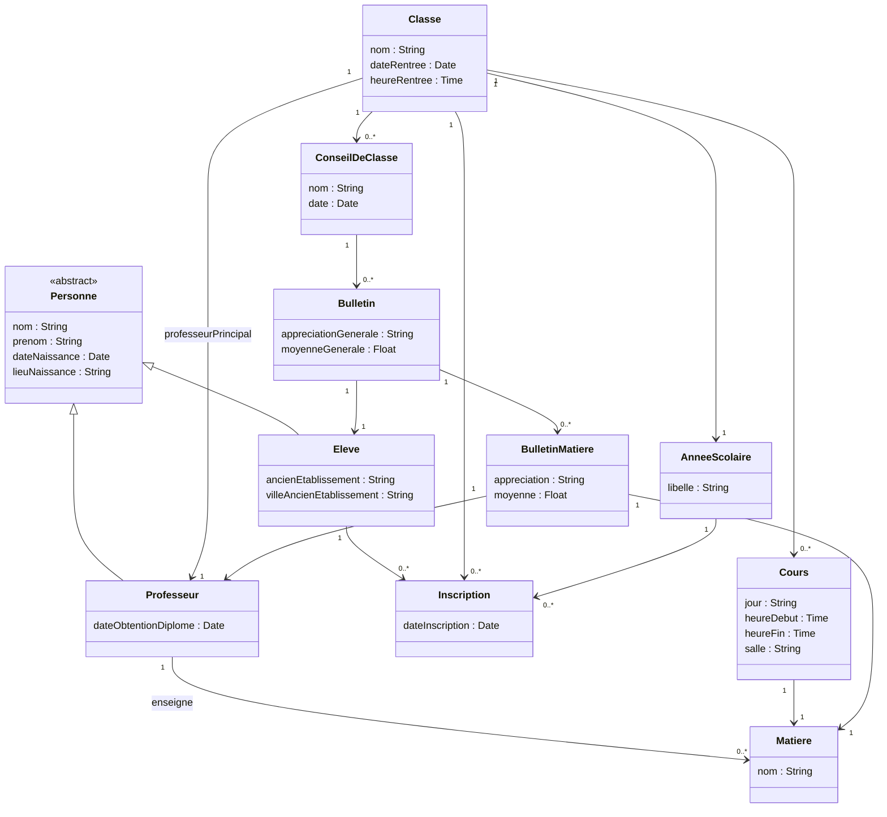

```mermaid

classDiagram


class Personne {
<<abstract>>
nom : String
prenom : String
dateNaissance : Date
lieuNaissance : String
}


class Eleve {
ancienEtablissement : String
villeAncienEtablissement : String
}


class Professeur {
dateObtentionDiplome : Date
}


class Matiere {
nom : String
}


class Classe {
nom : String
dateRentree : Date
heureRentree : Time
}


class AnneeScolaire {
libelle : String
}


class Inscription {
dateInscription : Date
}


class Cours {
jour : String
heureDebut : Time
heureFin : Time
salle : String
}


class ConseilDeClasse {
nom : String
date : Date
}


class Bulletin {
appreciationGenerale : String
moyenneGenerale : Float
}


class BulletinMatiere {
appreciation : String
moyenne : Float
}


Personne <|-- Eleve
Personne <|-- Professeur


Professeur "1" --> "0..*" Matiere : enseigne
Classe "1" --> "1" Professeur : professeurPrincipal


Classe "1" --> "0..*" Cours
Cours "1" --> "1" Matiere


Classe "1" --> "0..*" ConseilDeClasse
ConseilDeClasse "1" --> "0..*" Bulletin


Bulletin "1" --> "1" Eleve
Bulletin "1" --> "0..*" BulletinMatiere
BulletinMatiere "1" --> "1" Matiere
BulletinMatiere "1" --> "1" Professeur


Eleve "1" --> "0..*" Inscription
Classe "1" --> "0..*" Inscription
AnneeScolaire "1" --> "0..*" Inscription


Classe "1" --> "1" AnneeScolaire
```
