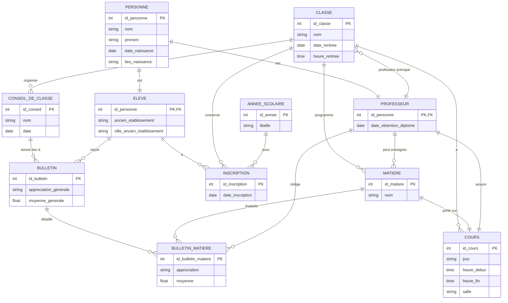

```mermaid
erDiagram
    PERSONNE {
        int id_personne PK
        string nom
        string prenom
        date date_naissance
        string lieu_naissance
    }

    ELEVE {
        int id_personne PK, FK
        string ancien_etablissement
        string ville_ancien_etablissement
    }

    PROFESSEUR {
        int id_personne PK, FK
        date date_obtention_diplome
    }

    CLASSE {
        int id_classe PK
        string nom
        date date_rentree
        time heure_rentree
    }

    ANNEE_SCOLAIRE {
        int id_annee PK
        string libelle
    }

    MATIERE {
        int id_matiere PK
        string nom
    }

    INSCRIPTION {
        int id_inscription PK
        date date_inscription
    }

    COURS {
        int id_cours PK
        string jour
        time heure_debut
        time heure_fin
        string salle
    }

    CONSEIL_DE_CLASSE {
        int id_conseil PK
        string nom
        date date
    }

    BULLETIN {
        int id_bulletin PK
        string appreciation_generale
        float moyenne_generale
    }

    BULLETIN_MATIERE {
        int id_bulletin_matiere PK
        string appreciation
        float moyenne
    }

    PERSONNE ||--|| ELEVE : "est"
    PERSONNE ||--|| PROFESSEUR : "est"

    ELEVE ||--o{ INSCRIPTION : "a"
    CLASSE ||--o{ INSCRIPTION : "concerne"
    ANNEE_SCOLAIRE ||--o{ INSCRIPTION : "pour"

    CLASSE ||--o{ MATIERE : "programme"
    PROFESSEUR ||--o{ MATIERE : "peut enseigner"

    CLASSE ||--o{ COURS : "a"
    MATIERE ||--|| COURS : "porte sur"
    PROFESSEUR ||--|| COURS : "assure"

    CLASSE ||--o{ CONSEIL_DE_CLASSE : "organise"
    CONSEIL_DE_CLASSE ||--o{ BULLETIN : "donne lieu à"
    ELEVE ||--o{ BULLETIN : "reçoit"

    BULLETIN ||--o{ BULLETIN_MATIERE : "détaille"
    MATIERE ||--o{ BULLETIN_MATIERE : "évaluée"
    PROFESSEUR ||--o{ BULLETIN_MATIERE : "rédige"

    CLASSE }o--|| PROFESSEUR : "professeur principal"
```
