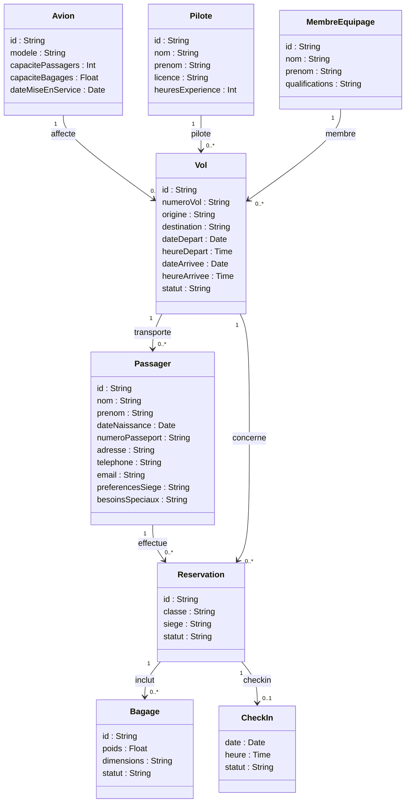

```mermaid
classDiagram

class Avion {
  id : String
  modele : String
  capacitePassagers : Int
  capaciteBagages : Float
  dateMiseEnService : Date
}

class Vol {
  id : String
  numeroVol : String
  origine : String
  destination : String
  dateDepart : Date
  heureDepart : Time
  dateArrivee : Date
  heureArrivee : Time
  statut : String
}

class Pilote {
  id : String
  nom : String
  prenom : String
  licence : String
  heuresExperience : Int
}

class MembreEquipage {
  id : String
  nom : String
  prenom : String
  qualifications : String
}

class Passager {
  id : String
  nom : String
  prenom : String
  dateNaissance : Date
  numeroPasseport : String
  adresse : String
  telephone : String
  email : String
  preferencesSiege : String
  besoinsSpeciaux : String
}

class Reservation {
  id : String
  classe : String
  siege : String
  statut : String
}

class Bagage {
  id : String
  poids : Float
  dimensions : String
  statut : String
}

class CheckIn {
  date : Date
  heure : Time
  statut : String
}

Avion "1" --> "0..*" Vol : affecte
Pilote "1" --> "0..*" Vol : pilote
MembreEquipage "1" --> "0..*" Vol : membre
Vol "1" --> "0..*" Passager : transporte
Passager "1" --> "0..*" Reservation : effectue
Vol "1" --> "0..*" Reservation : concerne
Reservation "1" --> "0..*" Bagage : inclut
Reservation "1" --> "0..1" CheckIn : checkin
```
